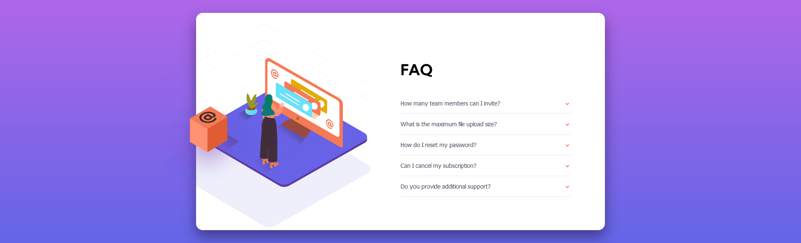

# Frontend Mentor - FAQ accordion card solution

This is a solution to the [FAQ accordion card challenge on Frontend Mentor](https://www.frontendmentor.io/challenges/faq-accordion-card-XlyjD0Oam). Frontend Mentor challenges help you improve your coding skills by building realistic projects. 

## Table of contents

- [Overview](#overview)
  - [The challenge](#the-challenge)
  - [Screenshot](#screenshot)
  - [Links](#links)
- [My process](#my-process)
  - [Built with](#built-with)
  - [What I learned](#what-i-learned)
  - [Useful resources](#useful-resources)
- [Author](#author)

**Note: Delete this note and update the table of contents based on what sections you keep.**

## Overview

### The challenge

Users should be able to:

- View the optimal layout for the component depending on their device's screen size
- See hover states for all interactive elements on the page
- Hide/Show the answer to a question when the question is clicked

### Screenshot

### Links

- GitHub Repo: [Link to Repository](https://github.com/Shadowbest/faq-accordions-card)
- Live Site URL: [Add live site URL here](https://your-live-site-url.com)

## My process

### Built with

- Semantic HTML5 markup
- CSS custom properties
- Flexbox
- CSS Grid

### What I learned

In this project I learned how to use JavaScript and have accessibility in mind when building web pages and widgets. I also learned how to position images in an element for different viewport sizes.
I still have to get better at positioning images as this challenge was quite difficult to do.

### Useful resources

- [WAI-Aria Authoring Practices](https://www.w3.org/TR/wai-aria-practices-1.2/) - This documentation helped me to understand better about accessibility and design patterns in which the accordion was implemented.
- [MDN](https://developer.mozilla.org/en-US/docs/Web/JavaScript) - This is an amazing site to learn about web technologies. This one is about JavaScript and it's an excellent resource for newcomers.

## Author

- Frontend Mentor - [@Shadowbest](https://www.frontendmentor.io/profile/Shadowbest)
